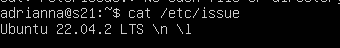

## Part 1. Установка ОС

* 
>Вывели версию Ubuntu Server

## Part 2. Создание пользователя

* 
>Команда для создания пользователя
* 
>Вывод команды `cat /etc/passwd`
* 
>Информация о добавлении нового пользователя в группу adm